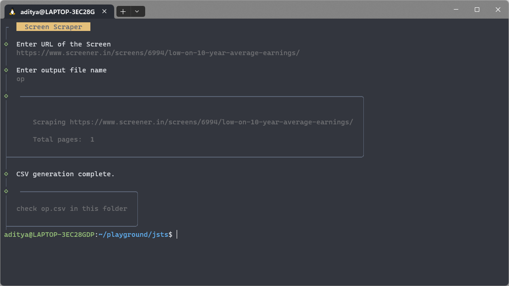

# Screener.in Screen Scraper CLI 👨‍💻

This is a simple command-line interface (CLI) tool for scraping screens from [Screener.in](https://screener.in) 📊, a popular financial data website. With this tool, you can easily fetch and retrieve data from Screener.in for your analysis and use it in your projects 🚀.

## Installation 📦

To get started, follow these simple installation steps:

1. Clone the repository to your local machine:

   ```
   git clone https://github.com/Adityakadali/screener-scraper
   ```

2. Navigate to the project directory:

   ```
   cd screener-scraper
   ```

3. Install the required dependencies:

   ```
   npm install
   ```

## How to Use 🤖

Once you have successfully installed the tool and its dependencies, you can start using it to scrape data from Screener.in:

1. Run the script by executing the following command:

   ```
   node main.js
   ```

2. The tool will prompt you for the necessary input, such as the Screener.in URL and any additional options or preferences.

3. It will then scrape the data from the provided URL and present it to you, allowing you to further process or analyze the data as needed.

### Demo 📷



This CLI tool simplifies the process of retrieving financial data from Screener.in and makes it convenient for your financial analysis or any other use cases.

Enjoy using the Screener.in Screen Scraper CLI! 🎉📈
